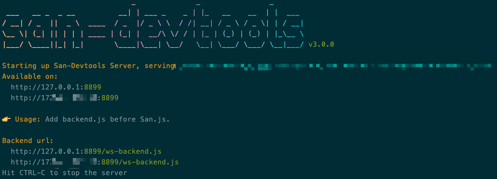

# San Devtools 使用指南

为了快捷方便的调试 **San** 应用，San Devtools 提供了两种调试方式：

- 以 Google Chrome 浏览器插件形式存在，支持传统浏览器的调试；
- 以命令行工具形式存在，提供 `san-devtools(简写sand)` 命令，支持以 **San** 为框架的页面远程调试，包括 IE、Safari、Mobile、Electron 形式的调试。

> 注意：在调试页面的时候两种方式不能同时存在，即当 **San-devtools Chrome 插件** 处于开启状态的时候，页面不能嵌入由 **命令行工具** 生成的 ws-backend.js，否则只有一个会生效，并且哪个生效是随机的，取决于两者的加载速度。

### 版本依赖
 - San devtools 的运行需要 **San 3.0.3-rc.17** 及以上的版本。
 - Store tab 的展现需要 **san-store 1.1.0** 及以上的版本。

> 提示：san-devtools 在 **San 3.1.4** 之前的版本中会向 `Object.prototype` 中设置 `__san_devtool__` 只读属性。在 3.1.4 之后的版本仅会向 `window`  对象设置。

- [下载](#下载)
- [安装](#安装)
    - [更新](#更新)
- [命令行工具](#命令行工具)
- [开发者工具](#开发者工具)
    - [图标](#图标)
    - [首页](#首页)
    - [设置](#设置)
    - [Component](#component)
    - [Store](#store)
    - [Store time travel](#timetravel)
    - [History](#history)
    - [Event](#event)
    - [Message](#message)
- [控制台直接调试](#控制台直接调试)


## 下载
目前支持以下的下载途径：

 - GitHub Releases：https://github.com/baidu/san-devtools/releases zip 格式。
 - Source code：`$ git clone https://github.com/ecomfe/san-devtools.git`

## 安装
目前支持以下几种安装途径

 - [Chrome 网上应用商店](https://chrome.google.com/webstore/detail/san-devtool/fcjifbggoejmfnfcmnaobcppbfhlndad?hl=zh-CN)
 - NPM：`$ npm i -g san-devtools`，`san-devtools` 命令参见下面 *命令行工具* 一节。
 - 手动安装：请自行搜索安装教程
 - Source code：
    ```
    $ git clone git@github.com:ecomfe/san-devtools.git
    $ cd san-devtools
    $ npm i
    $ npm run build:extensions
    $ cd packages/extensions/dist
    同手动安装
    ```

### 更新

 \- Chrome Web Store：自动更新。

 \- NPM：`npm update`。

## 命令行工具

通过 NPM 全局安装的 san-devtools 会提供一个名为 `san-devtools(简写为sand)` 的全局命令行工具，执行 `sand --help` 可以查看各参数的含义。这个工具可以启动本地 WebSocket 服务，通过嵌入提供的JS文件（ws-backend.js），建立 WebSocket 通信，实现任意 San 页面的远程调试能力。



1. 启动本地Server，默认自动打开 Remote Inspector 工具页面；

    ```bash
    # 启动本地server，自带WebSocket服务
    $ sand
    ```

2. 根据提示将 `ws-backend.js` 添加到要调试页面的 `San.js` 之前；

3. 打开要调试的页面；

4. 进入 `http://127.0.0.1:8899` 页面选择需要 debug 的页面，然后开始 San DevTools debug 之旅！

<p>
    <a href="https://raw.githubusercontent.com/baidu/san-devtools/master/docs/images/inspector-connected.png">
        
    </a>
</p>

<p>
    <a href="https://raw.githubusercontent.com/baidu/san-devtools/master/docs/images/light_mode.png">
        
    </a>
</p>

## san 开发者工具
### 图标
<p>
    <a href="https://raw.githubusercontent.com/baidu/san-devtools/master/docs/images/browser_action.png">
        
    </a>
</p>

在 Chrome 浏览器中安装好 san-devtools 扩展之后，我们会在 Chrome 的工具栏中看到 **San** 的图标，图标的默认状态为灰色。刷新当前页面，若检测到当前页面有使用 **San**，并且 `san.debug` 为 `true`，图标会变为 **San** 标准的蓝色，并且下方会显示出检测到的 **San** 的版本号。

#### Popup 窗口
<p>
    <a href="https://raw.githubusercontent.com/baidu/san-devtools/master/docs/images/san-detected.png">
        
    </a>
</p>

点击 **San** 图标会弹出 popup 窗口，此窗口中展示 san 的版本，以及引导文案。

### 首页
San-devtools 集成在浏览器内的开发者工具界面，位于浏览器开发者工具的 **San** 面板中。此面板分为上下两大部分。


 - 上部 **导航栏** 包括恒定显示的 *Component* tab 和 *History* tab。当使用了 san-store，则会追加 *Store* tab。当使用了 san-router，则会追加 *Route* tab。当 san 的版本在 3.9.4 及以上的时候，会追加 *Event* tab 以及 *Message* tab。
 - 下部 **内容区** 会在接下来的几个段落中详细介绍。

 ### 设置
 当点击 **导航栏** 的设置图标的时候，会弹出设置面板，包含几个 san-devtools 的全局选项。

<p>
    <a href="https://raw.githubusercontent.com/baidu/san-devtools/master/docs/images/setting.png">
        
    </a>
</p>

 - Readonly for component data：若勾选此选项，在浏览器开发者工具中的 **San** 面板中的 *Component tab* 中，选定组件显示出的组件 data 为只读，不允许修改其任何 key 及 value。
 - Readonly for store：若勾选此选项，在浏览器开发者工具中的 **San** 面板中的 *Store tab* 中，选定组件显示出的 payload 为只读，不允许修改其任何 key 及 value。
 - Readonly for event：若勾选此选项，在浏览器开发者工具中的 **San** 面板中的 *Event tab* 中，每条 Event 数据中的 payload 为只读。
 - Readonly for message：若勾选此选项，在浏览器开发者工具中的 **San** 面板中的 *Message tab* 中，选定组件显示出的 payload 为只读，不允许修改其任何 key 及 value。
 - Mode: 可以通过点击开关来切换页面的模式，共两种模式：light 以及 dark 模式。

### Component
浏览器开发者工具的 **San** 面板被打开后，会默认显示 *Component tab*。*Component tab* 由左右两个部分组成，中间通过一个可以拖动的分隔条隔开。左侧为页面的组件结构树。

##### 组件树区域: 
<p>
    <a href="https://raw.githubusercontent.com/baidu/san-devtools/master/docs/images/building_component_tree.png">
        
    </a>
</p>

第一次进入时，页面当前状态下的组件结构树会被一次性的加载，加载过程中会出现 *Building* 进度条，当进度条走完并且消失的时候，则代表整个组件结构树已经加载完毕，我们可以将整个树形结构滚动到底部来查看当前整个页面的组件结构。当页面的组件结构发生变化时，组件结构树会自动进行刷新。当组件较多的时候，加载可能会花费些时间，由于组件结构树的加载过程为异步的，这并不影响我们选择已经被加载出来的组件项目。其中每一条组件项目包含了四个内容：

 - Component name：默认情况为组件的 `source.tagName` 属性，当其不存在的时候，则显示组件的 `constructor.name`，为 `ComponentClass`。
 - Component ID：即组件实例的 `ID`，是组件实例的唯一标识，当一个组件被多次实例化之后，每个实例的 `ID` 都是不一样的，但是展示的组件名称是相同的。
 - Route：当此组件由路由器的路由规则匹配时渲染生成，则显示此额外信息，内容为实际的路径。
 - Store：当组件通过 `connect` 注入了 `store` 中的数据之后，会被标记为 `connected`。

<p>
    <a href="https://raw.githubusercontent.com/baidu/san-devtools/master/docs/images/filter.png">
        
    </a>
</p>

在组件结构树的顶部，有一个 filter bar，随着我们输入文本，下方的组件结构树会过滤出仅包含过滤文本的组件项目，过滤范围包括组件名、组件 ID、Store 信息等。当 filter bar 的文本为空时，恢复显示完整的组件结构树。

*san-devtools 的 Chrome 插件功能*：当右键选择页面元素的时候，从「上下文菜单」选择 *inspect san component*，component tab 会自动选中对应的组件实例，并展示详细信息。

<p>
    <a href="https://raw.githubusercontent.com/baidu/san-devtools/master/docs/images/inspect_component.png">
        
    </a>
</p>

##### 详细信息区域: 
Component tab 右侧为详细信息显示区域，包含了五个功能块：

 - Basic information：显示一个组件最基本的信息，包含了 ID，组件的祖先组件路径，parent/owner 组件信息，当组件被注入了 store 中的数据之后，还会有 store 的基本信息，包括 mapStates, mapActionsKeys。<br />
    <p>
        <a href="https://raw.githubusercontent.com/baidu/san-devtools/master/docs/images/basic_information_group.png">
            
        </a>
    </p>
 - Data viewer：这是一个 JSON viewer，展示一个组件的 data。这个 viewer 是可以修改的，我们可以进行 CRUD 操作，以及修改 object 中的 key。所有的修改会自动同步到组件的 data 中。
     <p>
        <a href="https://raw.githubusercontent.com/baidu/san-devtools/master/docs/images/component_data_group.png">
            
        </a>
    </p>
 - Computed：对应组件 computed 定义的 function，包含其所引用的 data 中的 key 及 value。<br />
      <p>
        <a href="https://raw.githubusercontent.com/baidu/san-devtools/master/docs/images/computed_group.png">
            
        </a>
    </p>
 - Filters：对应组件 filters 定义的 function。
 - Messages：对应组件 messages 定义的 function。

上述五个功能块并不确保会全部显示，当某一个功能块确定为空时会隐藏整个区域。

<p>
    <a href="https://raw.githubusercontent.com/baidu/san-devtools/master/docs/images/component_detail.png">
        
    </a>
</p>

详细信息显示区域的顶部包含了一个 title bar，其中包含了三部分：

 - Component name
 - Inspect 按钮：点击会跳转并且 inspect 至浏览器开发者工具 *Element* 面板。
 - filter bar：与组件结构树的 filter bar 类似，随着我们输入文本，下方的六个功能块会过滤出仅包含过滤文本的内容，过滤范围包括 viewer 的 key/value，各 function 的代码字符串文本。当 filter bar 的文本为空时，恢复显示完整的功能块内容。

### Store
*Store tab* 反映了在使用了 **San 框架的官方应用状态管理套件** 即 **san-store** 后，页面应用的状态及状态的变更。与 *Component tab* 类似，*Store tab* 由左右两个部分组成，中间通过一个可以拖动的分隔条隔开。左侧为页面加载至今的状态变更快照。

> 在 vuex 以及 react-redux 等这些状态管理库中，有对 action 与 mutation 的区分。但是在 san 中你不需要在代码中明确的声明 action 以及 mutation，因为一切都被看成 action，并且并非所有的 action 都会去改变 state。而在 san-devtools 中我们将修改 state 的action 称之为 mutation。


<p>
    <a href="https://raw.githubusercontent.com/baidu/san-devtools/master/docs/images/mutation_list.png">
        
    </a>
</p>

左侧的中每个项目包含了四个内容：

 - Action name：触发此状态变更的 action 的名字。
 - Action Id：触发此状态变更的 action 的 id。
 - 额外的标记：如果标记为 **useless** 则表示这次 mutation 没有改变 state

<p>
    <a href="https://raw.githubusercontent.com/baidu/san-devtools/master/docs/images/store_group.png">
        
    </a>
</p>

点击列表中的项目，右侧的详细信息区域会发生变化。从上之下包括：

 - Basic Information：包括下面几项
    - storeName：store 名称;
    - actionName：action 名称;
    - timeRange：执行的时间段，可以查看该 action 的执行时长是否异常。
    - status：状态，done 表示该 action 已经执行完毕，pending 表示执行中。当异步 action 的时候会出现 pending 的情况，并且要求 san-store 的版本为 v2.0.3+;
    - actionId：action 的唯一标识
    - parentActionId：触发该 action 的父 action id
    - childsId：该 action 触发的其他的子 action id
    - payload：该 action接收到的数据，支持修改该数据，点击 dispatch 按钮可以触发该 action，点击 time travel 按钮可以触发时间旅行，将页面回退到当前 mutation 触发之后的状态。
 - Diff：可以查看该 action dispatch 时， data 变化前后的所有差异。**⚠️ 注意：** 在 action 中使用 san-update 来修改数据的时候，需要将类似 builder().set(...) 的操作返回，这样 san-store 才能够获取到更新之后的 state。
 - Call stack：该部分是当前选中的 mutation 对应的 action 调用栈。每一个 action 部分都有对应的标题，接收的 payload 数据，点击右侧的三个小点你会看到有个 dispatch 操作按钮，你可以修改 payload 数据之后再点击 dispatch 操作按钮来触发一个新的 action。
 - Store state：表示当前 muattion 触发之后对应的 state。

> 提示：当使用了非官方的 connector 时，要确保在必要的时刻向 san-devtools 发送 `store-connected` `store-comp-inited` `store-comp-disposed` 事件，这样 san-devtools 才可以更好的生成 Store tab 中所需要状态变更快照。虽然已对无法收到上述事件做了替代方案，但这样可能会导致 Store tab 中某些地方为空。


### History


*History tab* 可以记录一段时间内 **San** 发往 san-devtools 的组件生命周期事件，展示的数据包括：

 - compiled
 - inited
 - created
 - attached
 - detached
 - disposed

上述几种事件参见 **San 教程** 中 **组件**一章的 *生命周期* 部分，这里不再赘述。

*History tab* 为一张表格，表格中的每一行包含了：

 - Timestamp：生命周期触发的时间戳，格式为 **分:秒:毫秒**。
 - Event：生命周期类型，上述生命周期之一。
 - Component：生命周期发生的组件，以组件 ID 显示，点击会跳转并且 inspect 至浏览器开发者工具 *Element* 面板。
 - Data：data 代表当生命周期钩子执行后组件 data 的快照。

顶部有两个部分构成：搜索框，操作按钮。搜索框的搜索规则为：两个关键字分别为「组件名称」以及「生命周期」，输入两个关键字的时候需要用 '.' 分割开。操作按钮有三个：从左到右分别为：开始/停止记录，清除所有，展示停止记录时间段触发的生命周期。

### Event


*Event tab* 可以记录下页面所有通过组件实例的 `fire` 方法触发的 **san** 自定义事件，*Event tab* 为一张表格，表格中的每一行包含了：

 - Timestamp：生命周期发出时间戳，格式为 **分:秒:毫秒**。
 - Event：自定义事件名称。
 - Component：自定义事件对应的组件，以组件 ID 显示，点击会跳转并且 inspect 至浏览器开发者工具 *Element* 面板。
 - Action：`fire` 操作按钮，点击可以触发一次事件。
 - Payload：事件触发接受到的值，该值可以被修改，当点击了 `fire` 按钮，新的值会作为此次事件的 payload。

 ### Message


*Message tab* 可以记录下页面所有通过组件实例的 `dispatch` 发送的消息，可以方便的追踪消息从触发到捕获的轨迹。*Message tab* 为一张表格，表格中的每一行包含了：

 - Timestamp：生命周期发出时间戳，格式为 **分:秒:毫秒**。
 - Message：消息的名称。
 - Sender：消息发送方组件，以组件 ID 显示，点击会跳转并且 inspect 至浏览器开发者工具 *Element* 面板。
 - Receiver：消息接收方组件，以组件 ID 显示，点击会跳转并且 inspect 至浏览器开发者工具 *Element* 面板。
 - Action：`dispatch` 操作按钮，点击可以触发一次事件。
 - Payload：消息传递的值，该值可以被修改，当点击了 `dispatch` 按钮，新的值会作为此次消息的 payload。

### profiler
*Profiler tab* 主要提供了页面中各个组件生命周期的耗时数据，会以两种方式来呈现，一种是以饼图以及表格的方式呈现统计数据，一种是以火焰图方式呈现在某一段时间内各个生命周期的耗时详细数据。

*表格加饼图*


*火焰图*


## 内置的chrome devtools
在从`npm`仓库中获取的`standalone`版本中，我们内置了`chrome-devtools`检查面板，因此可以适用于任何页面。


- 对于一般的用户可以将 `<script src="http://x.x.x.x:8899/ws-backend.js"></script>` 添加到项目模版中。
- 对于使用了 [esl](https://github.com/ecomfe/esl) 方案的项目或者其他`require.js`模块方案的项目，可以按照下面类似的方式接入远程调试
```
const host = 'xxx'; // 域名
const port = '8899'; // 端口
window.__san_devtool_ws_query__ = `?http://${host}:${port}/san-devtools.html&ws&wsHost=${host}&wsPort=${port}`;
require(['yyy/ws-backend-v8'], () => {});
```
注意需要在`window`上挂在一个属性`__san_devtool_ws_query__`


## 控制台直接调试


默认情况下，san-devtools 会在全局写入一个对象 `window.__san_devtool__`，里面包含了 san-devtools 用于展示开发者工具的所有源信息。包括：

 - san：**San** 全局对象。用于版本检测及 **San** hook 检测。
 - data：生成组件结构树的原始对象。
 - storeMap：所有 store 的实例的 Map，健为 store 的名称。
 - componentMap：页面上所有挂载了的组件实例的 Map，健为组件实例的 id。

除此之外，san-devtools 还会向组件挂载的 DOM 对象上附加一些内容：

 - \_\_SAN_INS_ID_PATH\_\_：组件的祖先组件路径。

通过 `window.__san_devtool__` 以及 DOM 上的组件路径，可以很方便快捷地找到组件对应的 dom，同样也可以从选中的 dom 找到对应的组件实例或者所在的组件实例。


